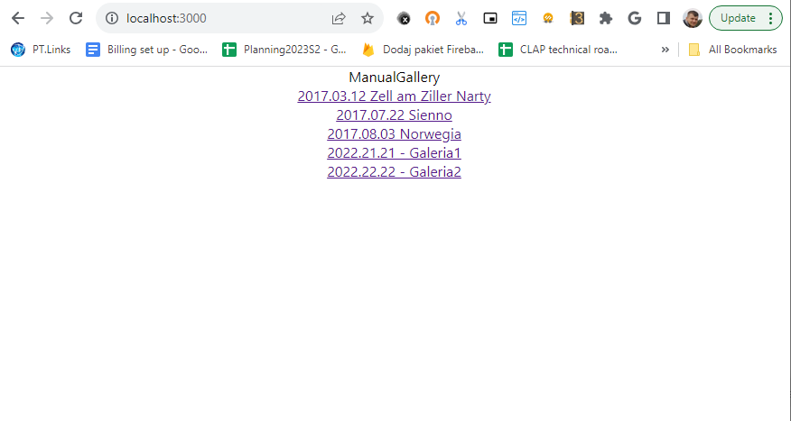
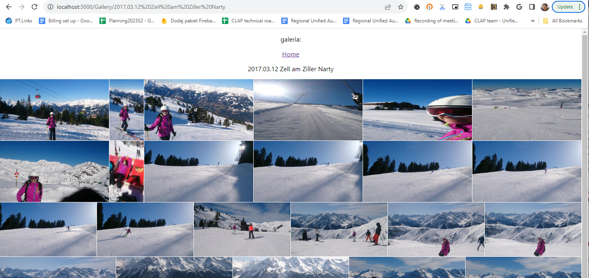

<!--Category:React--> 
 

    <a href="http://productivitytools.top/"><a> 
    

    

# PhotoGallery Web

Fronted to the Photo gallery application.

<!--more-->

Aplication is in the early stage, but I won't be investing more time in it. The idea was to create simple gallery, which will be hosted on the local server but producs on the market are more advanced.

Currently done
- List of galleries
- Login 

To run application go to http://localhost:3000/Login and provide your gmail account. It will redirect to list of galeries. Galeries are taken from the server. 

Clicking on gallery should load the pictures.

The next step was to add bearer to the picture url param and validate on the server side.

